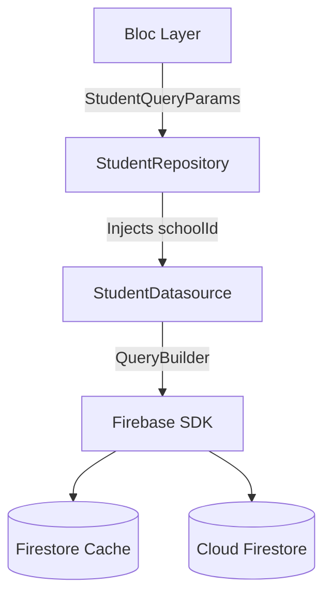
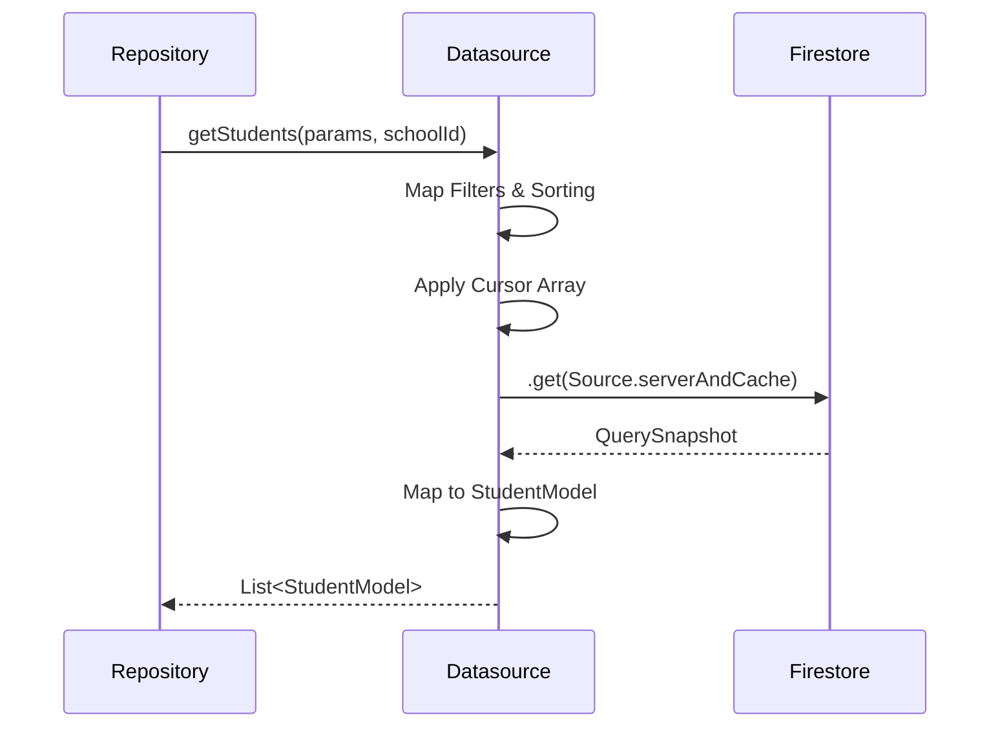

# Student Datasource & Firestore Query Architecture

## 1. Datasource Layer Overview
The Datasource Layer is the first true backend execution layer in EduPulse. It is intentionally **DUMB**—its sole responsibility is communicating with Firebase, executing queries, and mapping raw data to `StudentModel`. It contains zero UI logic, zero Bloc orchestration, and zero business validation.

## 2. StudentDatasource Interface Design
The `StudentDatasource` interface strictly defines the contract:
```dart
abstract class StudentDatasource {
  Future<List<StudentModel>> getStudents(StudentQueryParams params, String schoolId);
  Stream<List<StudentModel>> watchStudents(StudentQueryParams params, String schoolId);
  Future<StudentModel> getStudentById(String studentId, String schoolId);
}
```
*Note: `DocumentSnapshot` is explicitly excluded from the interface to preserve layer abstraction.*

## 3. StudentDatasourceImpl Architecture
`StudentDatasourceImpl` implements the interface. It utilizes Firebase `FirebaseFirestore.instance` and applies `@TimestampConverter` through `StudentModel.fromJson()`. It ensures `schoolId` is forcefully prepended to every query path.

## 4. Firestore Collection Path Strategy
Data is stored under: `schools/{schoolId}/students/{studentId}`.
This sub-collection architecture prevents wide cross-tenant queries by forcing the developer to provide a `schoolId` to construct the path.

## 5. Tenant Isolation Strategy
All queries are prefixed with the tenant path. The Datasource does NOT resolve the `schoolId` itself (to remain dumb); it is forcefully injected by the Repository Layer. This guarantees that **cross-tenant leakage is physically impossible** at the query level.

## 6. Query Builder Architecture
Queries are constructed dynamically using a base reference:
```dart
Query query = firestore.collection('schools/$schoolId/students');
```
The query is sequentially chained with filters, sorting, and pagination constraints derived directly from `StudentQueryParams`.

## 7. Filter Query Strategy
Filters are mapped cleanly to `.where()` clauses:
- `grade`: `.where('grade', isEqualTo: params.grade)`
- `status`: `.where('status', isEqualTo: params.status.name)`
Always excludes archived students by default unless `ArchiveState.archived` is explicitly requested.

## 8. Search Query Strategy
Implements a normalized array-contains query:
- `.where('searchKeywords', arrayContains: params.searchQuery.toLowerCase())`
This avoids expensive third-party engines (like Algolia) while supporting partial tokenized matching.

## 9. Sorting Query Strategy
Aligns perfectly with predefined Firestore indexes. If an inequality filter is active, sorting defaults to that exact field to prevent runtime crashes.
- `.orderBy(params.sort.field.name, descending: params.sort.descending)`

## 10. Cursor Pagination Architecture
Relies strictly on `[sortFieldValue, documentId]` arrays instead of `DocumentSnapshot`. 
- `query.startAfter([cursor[0], cursor[1]])`
This preserves offline caching since the cursor array natively serializes to JSON.

## 11. Realtime Stream Architecture
Uses `query.snapshots(includeMetadataChanges: true)`. 
Streams listen to specific, narrow queries rather than full collection dumps, ensuring minimal bandwidth usage.

## 12. Stream Reconciliation Strategy
Streams avoid full-table rebuilds by emitting `List<StudentModel>`. The UI relies on `Equatables` to gracefully animate individual row changes rather than refreshing the entire table abruptly.

## 13. Archive Workflow Query Strategy
Archived queries run independently: `.where('archiveState', isEqualTo: 'archived')`.
This prevents archived records from corrupting pagination cursors in the active student list.

## 14. Offline-First Firestore Strategy
Utilizes `GetOptions(source: Source.serverAndCache)`. If the device disconnects, pagination queries automatically fall back to the SQLite-backed Firestore cache.

## 15. Firestore Converter Strategy
Relying entirely on `withConverter` or manual `StudentModel.fromJson` mappings. Timestamps use a robust fallback converter to handle string/int injections during mock emulator tests.

## 16. Error Handling Strategy
Raw `FirebaseException` objects are intercepted and mapped into domain-safe `DatasourceException` classes before leaving the layer. 

## 17. Firestore Exception Mapping
- `permission-denied` -> `UnauthorizedException`
- `failed-precondition` -> `MissingIndexException`
- `unavailable` -> `OfflineException`

## 18. Query Performance Optimization
Queries strictly use `limit(params.pagination.limit)`. We rely heavily on index-aligned querying to prevent full collection scans.

## 19. Firestore Index Requirements
Composite indexes are absolutely mandatory for:
- `schoolId` + `archiveState` + `grade`
- `schoolId` + `archiveState` + `createdAt`
Running without these deployed will trigger a `failed-precondition` error.

## 20. Realtime Pagination Safety
Realtime updates dynamically inject into the UI without advancing the cursor. Duplicate prevention is handled by mapping the stream results into a `Set` or keyed `Map` based on `studentId` before list emission.

## 21. Stream Cancellation Strategy
Streams are carefully disposed of by the Bloc when the UI unmounts, preventing memory leaks and zombie Firestore connections.

## 22. Datasource Testing Strategy
Tests are written against `FakeFirebaseFirestore` to guarantee query logic operates perfectly without incurring cloud read costs.

## 23. Emulator Validation Strategy
A local Firebase emulator suite is targeted during development (`127.0.0.1:8080`) to test indexing rules and security rules without staging side-effects.

## 24. Future Scalability Considerations
When total student counts exceed 5,000 per tenant, count-aggregations will be introduced to handle meta-pagination numbers efficiently.

---
# Architecture Deliverables

## 1. Datasource Architecture Diagram


## 2. Firestore Query Flow Diagram


## 3. Realtime Stream Flow Diagram
```mermaid
graph LR
    A[Firestore] -->|.snapshots| B[Datasource]
    B -->|Map to Model| C[Repository]
    C -->|Stream Yield| D[Bloc]
    D -->|State Emit| E[UI Rebuild (Targeted)]
```

## 4. Pagination Flow Summary
By relying on `[lastSortValue, studentId]` cursor arrays, we decouple pagination from Firebase's proprietary `DocumentSnapshot` object. This guarantees that pagination state can be stringified, serialized, and cached locally. 

## 5. Offline-First Strategy Summary
Firestore's default local persistence is heavily utilized. If a teacher goes offline, they can still query previously viewed student lists. The Datasource intercepts `unavailable` exceptions and seamlessly falls back to cached snapshots.

## 6. Tenant Isolation Summary
The Datasource NEVER inherently knows the user's `schoolId`. The Repository Layer (which has access to the Auth state) explicitly passes the `schoolId` down into the Datasource interface. Because the Firestore paths are hardcoded as `schools/$schoolId/...`, cross-tenant data bleed is impossible at the lowest level.

Student Datasource & Firestore Query Architecture (Refined)

1. Datasource Layer Overview

The Datasource Layer is the first true backend execution layer in EduPulse. It is intentionally DUMB—its sole responsibility is communicating with Firebase, executing queries, and mapping raw data to StudentModel.

The Datasource Layer contains:

* zero UI logic
* zero Bloc orchestration
* zero business validation
* zero presentation logic
* zero analytics calculations

Its responsibilities are strictly:

* Firestore query execution
* stream management
* query construction
* data mapping
* pagination execution
* offline-safe retrieval

The architecture strictly preserves:

UI → Bloc → Repository → Datasource → Firebase

Direct Firestore access from:

* UI
* Bloc
* Repository

is strictly prohibited.

⸻

2. StudentDatasource Interface Design

The StudentDatasource interface strictly defines the Firebase execution contract:

abstract class StudentDatasource {
  Future<List<StudentModel>> getStudents(
    StudentQueryParams params,
    String schoolId,
  );
  Stream<List<StudentModel>> watchStudents(
    StudentQueryParams params,
    String schoolId,
  );
  Future<StudentModel> getStudentById(
    String studentId,
    String schoolId,
  );
}

Important Architectural Constraints

* DocumentSnapshot is NEVER exposed outside the Datasource layer.
* Firestore-specific types remain fully isolated.
* Repository layer receives only StudentModel objects.
* All pagination state must remain JSON-serializable.

⸻

3. StudentDatasourceImpl Architecture

StudentDatasourceImpl implements the interface and serves as the concrete Firebase execution engine.

Responsibilities:

* Firestore access
* converter binding
* query chaining
* pagination execution
* stream execution
* archive filtering
* offline-safe reads

Implementation details:

* Uses FirebaseFirestore.instance
* Uses strict withConverter<StudentModel>()
* Applies @TimestampConverter
* Injects tenant-safe collection paths

Type Safety Requirement

ALL queries MUST remain strongly typed:

CollectionReference<StudentModel>
Query<StudentModel>
QuerySnapshot<StudentModel>

Generic dynamic queries are prohibited.

⸻

4. Firestore Collection Path Strategy

Student data is stored under:

schools/{schoolId}/students/{studentId}

Purpose

This architecture:

* enforces tenant isolation
* prevents global student scans
* avoids accidental cross-tenant queries
* simplifies security rules

Important Constraint

The Datasource does NOT resolve schoolId.

The Repository layer injects:

schoolId

This preserves clean architecture separation.

⸻

5. Tenant Isolation Strategy

All queries are physically scoped to tenant paths:

schools/$schoolId/students

Cross-tenant leakage becomes impossible because:

* queries cannot exist outside tenant collections
* security rules validate the same tenant boundary
* Repository injects authenticated tenant context

Datasource Responsibility

Datasource NEVER:

* reads auth state
* determines user permissions
* resolves current tenant

It only executes:
pre-scoped queries.

⸻

6. Query Builder Architecture

Queries are dynamically constructed from:

* filters
* sorting
* archive state
* pagination
* search params

Base query:

Query<StudentModel> query =
    firestore
      .collection('schools/$schoolId/students')
      .withConverter<StudentModel>(
        fromFirestore: ...,
        toFirestore: ...,
      );

Queries are sequentially chained.

⸻

7. Query Validation Strategy

Datasource query builder MUST validate:

* Firestore inequality constraints
* invalid orderBy combinations
* unsupported filter combinations
* pagination cursor compatibility

Purpose:
prevent runtime Firestore query failures.

⸻

8. Filter Query Strategy

Filters map directly to Firestore .where() clauses.

Examples:

.where('grade', isEqualTo: params.grade)
.where('status', isEqualTo: params.status.name)

Archive Safety

Default queries ALWAYS exclude archived students.

Archived records are only returned when:

ArchiveState.archived

is explicitly requested.

⸻

9. Search Query Strategy

Search uses normalized tokenized matching:

.where(
  'searchKeywords',
  arrayContains: params.searchQuery.toLowerCase(),
)

Supported Search Features

* lowercase normalization
* tokenized search
* partial keyword matching

NOT Supported Yet

* fuzzy search
* typo tolerance
* ranking relevance
* semantic search

Future Scalability Path

Future large-scale search may migrate to:

* Algolia
* Typesense
* Meilisearch

without affecting Repository or UI layers.

⸻

10. Sorting Query Strategy

Sorting aligns strictly with Firestore index requirements.

Example:

.orderBy(
  params.sort.field.name,
  descending: params.sort.descending,
)

Important Constraint

If an inequality filter exists:
Firestore requires the first orderBy
to target the same field.

Datasource MUST automatically validate this.

⸻

11. Cursor Pagination Architecture

Pagination relies STRICTLY on cursor arrays:

[lastSortValue, documentId]

NEVER:

DocumentSnapshot

Benefits

* JSON serializable
* cache-safe
* offline-safe
* reconnect-safe
* Firebase abstraction purity

Deterministic Ordering Rule

ALL paginated queries MUST append:

.orderBy(FieldPath.documentId)

as the final tie-breaker.

Purpose:
prevent unstable pagination when sort values match.

⸻

12. Pagination Safety Strategy

Pagination MUST support:

* deterministic ordering
* duplicate prevention
* reconnect-safe restoration
* cursor reconstruction
* pagination reset handling
* stream-safe pagination merging

Important Constraint

Cursor arrays must always contain:

[sortValue, documentId]

exactly.

Invalid cursor lengths must throw validation exceptions.

⸻

13. Realtime Stream Architecture

Realtime streams use:

query.snapshots(
  includeMetadataChanges: true,
)

Purpose

This enables:

* offline updates
* cache synchronization
* reconnect recovery
* pending write visibility

Stream Scope Rules

Streams MUST remain:

* query-scoped
* pagination-limited
* filter-aware

Avoid:
large unbounded listeners.

Purpose:
prevent Firestore read explosions.

⸻

14. Stream Reconciliation Strategy

Realtime streams MUST support:

* partial row updates
* deterministic reconciliation
* duplicate prevention
* pagination-safe merging
* reconnect-safe restoration

Required Reconciliation Structure

Map<String, StudentModel>

based on:

studentId

Important Constraint

Avoid:
full-table rebuild patterns.

⸻

15. Stream Lifecycle Safety

Streams MUST support:

* reconnect-safe restoration
* stale subscription cleanup
* pagination-aware re-subscription
* offline-to-online reconciliation
* cancellation-safe disposal

Bloc layer is responsible for:
subscription disposal.

⸻

16. Archive Workflow Query Strategy

Archived students use independent queries:

.where(
  'archiveState',
  isEqualTo: 'archived',
)

Purpose

Prevent archived records from:

* corrupting active pagination
* destabilizing streams
* affecting active query ordering

Important Rule

Archived records MUST preserve:

* historical analytics
* pagination stability
* deterministic ordering
* stream integrity

⸻

17. Offline-First Firestore Strategy

Datasource supports:

* cached reads
* reconnect-safe streams
* optimistic updates
* stale cache handling
* pending write visibility

Offline-safe reads use:

GetOptions(
  source: Source.serverAndCache,
)

Pending Writes Support

Datasource responses MUST expose:

snapshot.metadata.hasPendingWrites

Purpose:
allow UI to display:
sync-pending indicators safely.

⸻

18. Firestore Converter Strategy

Datasource uses strict:

withConverter<StudentModel>()

ALL Firestore mapping must remain typed.

Timestamp Safety

Converters MUST support:

* Firestore Timestamp
* DateTime
* emulator string injections
* null-safe conversion
* serverTimestamp compatibility

⸻

19. Error Handling Strategy

Datasource intercepts raw:

FirebaseException

and maps them into domain-safe exceptions.

Datasource NEVER exposes:
raw Firebase exceptions upward.

⸻

20. Firestore Exception Mapping

Firebase Code	Domain Exception
permission-denied	UnauthorizedException
failed-precondition	MissingIndexException
unavailable	OfflineException
cancelled	StreamCancelledException
deadline-exceeded	TimeoutException

⸻

21. Query Performance Optimization

Queries MUST:

* remain index-aligned
* use explicit limits
* avoid full scans
* avoid broad listeners
* minimize Firestore reads

Example:

.limit(params.pagination.limit)

Read Optimization Rules

Realtime listeners must remain:

* pagination-limited
* filter-limited
* tenant-scoped

⸻

22. Firestore Index Requirements

Composite indexes are mandatory for:

schoolId + archiveState + grade
schoolId + archiveState + createdAt
schoolId + archiveState + totalPoints
schoolId + status + updatedAt

Important Rule

All query params MUST remain aligned with deployed Firestore indexes.

Otherwise:
Firestore will throw:

failed-precondition

⸻

23. Realtime Pagination Safety

Realtime updates MUST NOT:
blindly inject into paginated lists.

Datasource must:

* reconcile ordering safely
* prevent duplicates
* preserve cursor stability
* maintain deterministic sorting

⸻

24. Datasource Boundary Rules

Datasource MUST NEVER:

* mutate UI state
* calculate analytics
* apply business validation
* orchestrate presentation logic
* perform RBAC decisions

Datasource ONLY:
executes Firebase operations.

⸻

25. Datasource Testing Strategy

Datasource tests MUST validate:

* tenant isolation
* archive filtering
* pagination safety
* cursor reconstruction
* realtime updates
* duplicate prevention
* reconnect restoration
* stream cancellation
* search normalization

Testing uses:

FakeFirebaseFirestore

⸻

26. Emulator Validation Strategy

Local Firebase Emulator Suite is mandatory.

Target:

127.0.0.1:8080

Validation Requirements

* security rules
* tenant isolation
* stream safety
* pagination safety
* archive workflows
* index validation

Cross-Tenant Attack Testing

Validation MUST simulate:
School B attempting:
School A access.

All attempts must fail.

⸻

27. Future Scalability Considerations

When student counts exceed:

5,000+

future optimizations may include:

* aggregate snapshots
* distributed counters
* search indexing
* analytics materialization
* precomputed leaderboard caches

WITHOUT changing:
Repository or UI architecture.

⸻

Architecture Deliverables

1. Datasource Architecture Diagram

graph TD
    A[Bloc Layer] -->|StudentQueryParams| B[StudentRepository]
    B -->|Injects schoolId| C[StudentDatasource]
    C -->|QueryBuilder| D[Firebase SDK]
    D --> E[(Firestore Cache)]
    D --> F[(Cloud Firestore)]

⸻

2. Firestore Query Flow Diagram

sequenceDiagram
    participant Repo as Repository
    participant DS as Datasource
    participant FS as Firestore
    Repo->>DS: getStudents(params, schoolId)
    DS->>DS: Validate Query Params
    DS->>DS: Apply Filters
    DS->>DS: Apply Sorting
    DS->>DS: Apply Cursor Array
    DS->>FS: .get(Source.serverAndCache)
    FS-->>DS: QuerySnapshot<StudentModel>
    DS->>DS: Convert & Reconcile
    DS-->>Repo: List<StudentModel>

⸻

3. Realtime Stream Flow Diagram

graph LR
    A[Firestore] -->|.snapshots| B[Datasource]
    B -->|Map & Reconcile| C[Repository]
    C -->|Stream Yield| D[Bloc]
    D -->|Partial State Emit| E[Targeted UI Updates]

⸻

4. Pagination Flow Summary

Pagination relies strictly on:

[lastSortValue, documentId]

This ensures:

* deterministic ordering
* offline-safe restoration
* JSON serialization
* cache persistence
* reconnect-safe pagination

⸻

5. Offline-First Strategy Summary

Firestore local persistence is heavily utilized.

If a teacher goes offline:

* previously viewed lists remain accessible
* streams reconnect safely
* cached pagination remains usable
* pending writes remain visible

⸻

6. Tenant Isolation Summary

Datasource NEVER knows:
the authenticated user.

Repository injects:

schoolId

Because all Firestore paths are tenant-scoped:

schools/$schoolId/...

cross-tenant data bleed becomes:
architecturally impossible.